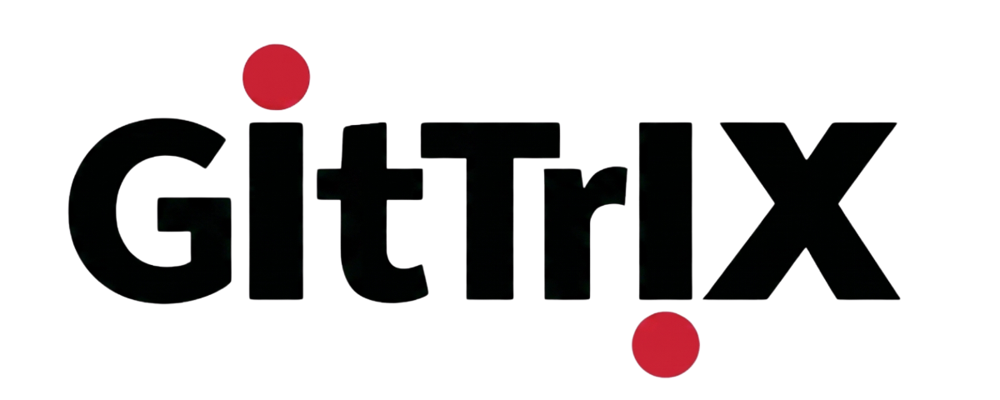

# Gittrix

Gittrix is a storage router for AI coding workflows.

It keeps agent work in ephemeral session repos and only moves accepted changes to your real repo when a human promotes them.

## Why this exists

- Agents generate a lot of throwaway code.
- Direct agent commits pollute real history.
- You need a clean promotion gate controlled by humans.

Gittrix gives you that gate.

## What you get

- Ephemeral session workspace per task
- Agent API with no durable-write path
- Human-only `promote` operation
- Baseline conflict detection before promote
- Single synthetic commit on durable for clean history

## Current status

v0.1 local MVP.

Implemented now:

- `@gittrix/core`
- `@gittrix/adapter-local`
- `gittrix` CLI

## Install

```bash
bun install
```

## Build, typecheck, test

```bash
bun run build
bun run typecheck
bun run test
```


## Mental model

1. Start session from durable baseline.
2. Agent edits and commits in ephemeral workspace.
3. Human reviews diff and promotes accepted changes.
4. Gittrix writes one clean commit to durable.
5. Session is evicted per policy.

## License

MIT
